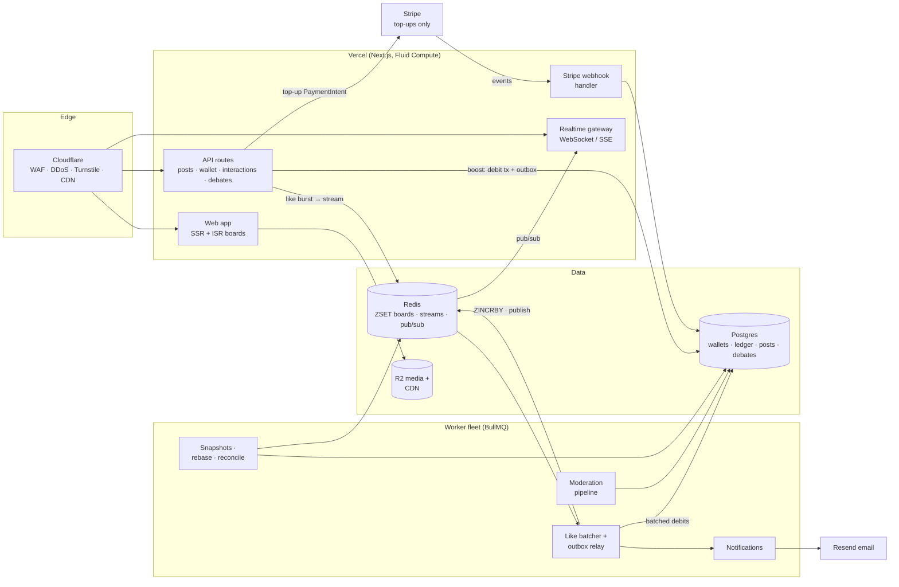
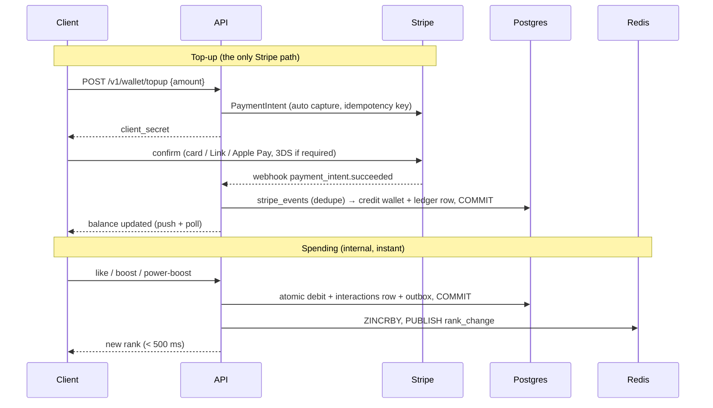

# ShowItGlo — Startup Blueprint

**showitglo.com · Working title "AttentionMarket" · August 2026 · Rev 4 (demands & insights)**

A public arena where the world's opinions fight for rank. A like costs a cent. A boost costs a dime. A crowd of thousands can beat a millionaire — and a millionaire can beat a lukewarm crowd. Pick a side, join its roster, and drag your question's answer to the front page of the internet. Aim a **demand** at a company — "McDonald's: give us a new burger" — and make them answer on the record. Brands fight too — in the open, always labeled — and companies buy the **Insights API** to read the aggregate of what the world pays to say, while scraping protection keeps that data from being taken for free. Nothing expires; every fight is public and permanent. **The market decides what the world sees, one cent at a time.**

---

## Contents

**Verdict**
1. [Honest assessment](#1--honest-assessment-the-original-spec-would-fail)
2. [The redesign](#2--the-redesign-five-changes-that-make-it-work)

**Product**
3. [Vision](#3--product-vision)
4. [Requirements](#4--product-requirements)
5. [Business model](#5--business-model--monetization)

**Market engine**
6. [Paid interactions & bidding](#6--paid-interactions--bidding)
7. [Ranking algorithm](#7--ranking-engine-algorithm)
8. [Outbid & fight logic](#8--outbid--fight-logic)
9. [Debates, sides & brands](#9--debates-sides--brands-in-the-arena)

**Engineering**
10. [Stack selection](#10--stack-selection)
11. [System architecture](#11--system-architecture)
12. [Database schema](#12--database-schema)
13. [API specification](#13--api-specification)
14. [Payments: wallet + Stripe](#14--payments-wallet--stripe)
15. [Real-time system](#15--real-time-system)
16. [Frontend & mobile](#16--frontend-ux--mobile)

**Trust & safety**
17. [Security](#17--cybersecurity-architecture)
18. [Moderation & legal](#18--moderation-strategy--compliance)

**Operations**
19. [Scalability](#19--scalability-strategy)
20. [Cost estimates](#20--cost-estimates)
21. [Revenue projections](#21--revenue-projections--honest-ones)
22. [Growth strategy](#22--growth-engineered-spectacle)

**Execution**
23. [MVP roadmap](#23--mvp-roadmap--6-weeks-to-launch)
24. [Production roadmap](#24--production-roadmap)
25. [Risks](#25--risks--mitigations)
26. [Implementation plan](#26--complete-implementation-plan)

---

## 1 · Honest assessment: the original spec would fail

You asked for brutal honesty, so it comes first. The one-line pitch — a permanent, pay-to-rank public board — is genuinely interesting and cheap to test. But four structural flaws in the original spec would kill it, and all four are fixed in the redesign (§2) this blueprint builds.

| Dimension | Grade | Why |
|---|---|---|
| Novelty / story | A− | "The front page of the internet, for sale" is a headline journalists will write for you. The Million Dollar Homepage proved the stunt works once. |
| Demand-side economics | **F** | As originally specced, people pay for attention that doesn't exist yet. Rank #1 on an empty board is worth $0, so nobody rational pays, so the board stays empty. The value loop is circular and starts at zero. |
| Content quality | **D** | Adverse selection: with one wallet per post, the people who pay most for attention are advertisers, crypto shills, and political operators. A feed ranked purely by individual promotional budget converges on a wall of billboards. *(Fixed by the penny-like fight model, §2 Change 2.)* |
| Revenue durability | C− | A one-time bid that holds a position *forever* is one-shot revenue plus dead capital. Early posts lock cheap ranks eternally; the board fossilizes; there is nothing left to sell. |
| Legal exposure | **D** | Anonymous + paid + political statements is the single most regulated combination in online speech (EU DSA political-ads transparency, election law, sanctions). "Never deleted" collides head-on with GDPR erasure, DMCA, and CSAM law. |
| Cost to test | **A** | The MVP is a leaderboard, a wallet, and email login. Two engineers, six weeks, under $200/month of infrastructure. This is the idea's strongest property: it is cheap to be wrong. |

### The four flaws, precisely

1. **Cold start is fatal, not incremental.** Attention only exists if spectators come; spectators only come if the board is dramatic; drama only exists if people pay. The Million Dollar Homepage solved this with a one-time press spectacle — and none of its hundreds of clones ever replicated it, because the mechanic alone isn't the product. *The spectacle is the product.*
2. **Perpetual positions destroy the market you're selling.** If a 2026 bid holds rank #40 forever, then by 2028 the top 100 is a museum, new bidders face exponentially ratcheted prices for stale neighborhoods, and your revenue asymptotes to zero. "Posts never disappear" is a great promise for *the post*; it is a terrible rule for *the ranking*.
3. **Single-payer ranking selects for the worst content.** One wallet per post means the board reflects individual promotional budgets. That is Google Ads with worse targeting. The defensible version is a board that reflects *fights between crowds and wallets* — which no ad network can replicate.
4. **Anonymous paid political speech is a business-ending liability, not a feature.** You would be operating an unregistered political advertising network with hidden funders. The EU Digital Services Act and the 2024 EU political-advertising regulation require disclosure of who paid; several jurisdictions ban paid anonymous political ads outright. This isn't a moderation problem — it's a licensing-and-liability problem.

---

## 2 · The redesign: five changes that make it work

Everything else in this document designs the *revised* concept. The soul of the idea survives — a permanent public market where money ranks what the world sees — but five rules define how it actually works.

> **Change 1 — Attention decays; posts don't.**
> Paid interactions buy **attention score** that decays with a 7-day half-life. $100 of backing is worth $50 of rank after a week, $25 after two. Posts are never deleted and every permalink lives forever — but *rank* is a flow, not a stock. This fixes three problems at once: the board stays alive (stale opinions sink on their own), revenue recurs (holding #1 requires ongoing backing — it's rent, not a purchase), and early-mover lock-in disappears. The promise stays honest: nothing expires, but relevance is earned continuously.

> **Change 2 — Everyone pays, and every cent is a vote: likes are $0.01, boosts are $0.10.**
> This is the core concept. Ranking is a **fight**, not a promotion product. Any user can put money behind any opinion, starting at one cent: a **like is $0.01**, a **boost is $0.10**, bigger boosts go up from there (§6). An opinion's rank is the decayed sum of every cent ever put behind it — so a crowd of 100,000 penny-likers ($1,000+ of ranking power, repeatable daily) can beat a whale's $5,000, and a determined whale can beat a lukewarm crowd. Neither side wins by default; that unresolved tension is the spectacle. Two supporting rules make the fight fair and watchable: **(a)** every opinion displays both numbers — money *and* people ("$8,430 · 51,244 backers") — so crowd victories are legible and astroturf looks exactly as hollow as it is; **(b)** money only speaks *for*, never *against* — you cannot pay to push an opinion down; disagreement is expressed by backing a **counter-opinion** (a linked rebuttal), and the biggest standing conflicts become named **debates with sides** (§9). One hard technical consequence: Stripe's ~$0.30 fixed fee makes a 1-cent charge impossible, so micro-pricing **forces a prepaid wallet** (§14) — which turns out to improve the product on every axis.

> **Change 3 — Launch one board, not twelve.**
> Twelve category leaderboards on day one means twelve empty rooms. Launch with the **Global board only**, seeded by a launch stunt (§22). Open a category only when organic demand exists (e.g., 50+ posts/week tagged with it). Categories are a scaling feature, not a launch feature. The schema supports them from day one; the UI hides them.

> **Change 4 — No political ads at launch; pseudonymous, not anonymous.**
> Personal political *opinions* by individuals are allowed — this is an opinion platform. Organized political *advertising* (parties, PACs, campaigns, coordinated issue campaigns) is banned in the ToS until you can afford a compliance function (identity verification of political payers, a public ad registry, per-jurisdiction rules). "Anonymous" becomes **pseudonymous**: the public sees an alias or nothing; the platform always knows the verified email and the payment identity. That's not a compromise — card payments make true anonymity impossible anyway, and pretending otherwise is a legal trap.

> **Change 5 — "Permanent" means never expired, not never removed.**
> Posts are never deleted *for age or rank*. They absolutely are removed for illegality, ToS violations, GDPR erasure requests, and DMCA. The public promise is "we never memory-hole you for being old or outbid" — a real differentiator against algorithmic feeds — stated precisely enough to survive contact with a regulator.

**What survives from the original spec unchanged:** money as the only ranking signal (no engagement algorithm — that's the brand), permanent URLs and full ranking history, email-verified pseudonymous posting, advertisement posts as first-class citizens (always labeled), admin-switchable bid-increment strategies, and outbid wars at the center of the product.

---

## 3 · Product vision

**ShowItGlo is a fight for the front page of the internet.** The unit of content is the *opinion* — a short, statement-shaped post — and its rank is a live measure of how much the world will pay to stand behind it. Every social platform ranks content by an opaque engagement model and buries it within hours. ShowItGlo has exactly one, perfectly honest algorithm: money. A like is a cent. A boost is a dime. "Put your money where your mouth is" is not the tagline; it is the entire mechanic.

Every opinion carries two numbers — **dollars and backers** — and the tension between them is the product: `$41,208 · 63,112 backers` is the people's champion; `$39,100 · 3 backers` is a whale making a stand. You can never pay to push an opinion *down*; you back the counter-opinion and race it up. Disagreement is elevation, so fights generate content instead of suppressing it. The biggest questions — *Is AI good for humanity? Messi or Ronaldo? Does pineapple belong on pizza?* — live as permanent **debates**: named arenas with two rosters, where backing a side means joining it (§9). And advertisers aren't hidden in the plumbing — **brands fight in the open**, always labeled, because a brand publicly spending to defend #1 is content, not clutter.

Because nothing expires, the platform compounds into something no poll or focus group can match: **a permanent, money-weighted record of what people actually want, for all time.** Opinions aren't only verdicts ("AI is good") — they're **demands** ("McDonald's: give us a plant-based Big Mac"), aimed at named companies and backed by crowds. A brand can answer a demand officially, on the record, and that answer is a PR moment the crowd created. The aggregate of all this paid conviction — what people like, reject, and demand, over time — is itself a product: companies buy **Insights API** access to the anonymized aggregates (§9), and scraping protection (§17) ensures nobody takes for free what customers pay for.

- **For spectators** (the majority, free): the most expensive argument on the internet, updated live. You come to watch what the world is paying to say — and one $5 top-up turns you from spectator to combatant.
- **For the crowd**: a penny at a time, put your side — your take, your team, your cause — on the world's front page, together, with your name on the roster.
- **For statement-makers and whales**: guaranteed, measurable, permanent visibility with a public receipt. No algorithm to appease. Owning #1 is the flex.
- **For brands**: the only ad product where the audience *watches you spend* — labeled ad posts in the open market, sponsored debates, brand-vs-brand fights, official answers to crowd demands, and the Insights API: live, money-weighted consumer research (§9).

**North-star metrics:** weekly active spectators, and the share of spend going to posts the spender didn't author (fight health — this number is what separates an arena from a billboard). **Mission-level bet:** transparent, crowd-priced ranking becomes a legitimate third model of content distribution alongside algorithmic and chronological feeds.

---

## 4 · Product requirements

### Personas

| Persona | Motivation | Pays? |
|---|---|---|
| **Spectator** | Entertainment; watching fights; discovering what people pay to say | Not yet — one $5 top-up converts them |
| **Crowd member ("penny army")** | Push their side's opinion up; beat the rival roster; identity expression | Yes — $0.01–$1/day, high frequency |
| **Statement-maker** | Proposals, manifestos, memorials, flexes — moments worth paying for | Yes, occasionally large |
| **Brand / advertiser** | Labeled ad posts in the open market; sponsored debates; brand-vs-brand fights; measurable, watchable spend | Yes, $100–$50k, sales-assisted at the top end |
| **Whale** | Status; owning #1 is the product | Yes, $1k+ — a handful drive a large revenue share |
| **Moderator / admin** | Keep the arena legal and brand-safe; operate the market | Internal |

### Functional requirements

- **Posting:** opinions (≤500 chars, statement-shaped) as the primary kind; image posts; advertisement posts (always labeled "Ad"); **counter-opinions** — a linked rebuttal creating a visible fight pair; **demands** — opinions aimed at a named company ("McDonald's: make a new burger"), which the targeted brand can answer with an official on-the-record response; author shown as alias, real name, or "anonymous"; permanent canonical URL (`/p/{slug}`); posts immutable after the first paid interaction (a ranked opinion is a public record).
- **Identity:** passwordless email magic-link auth; email verification required before a post goes live or money moves; optional public profile; **verified brand accounts** (§9) whose backing is always publicly labeled.
- **Wallet:** top-ups of $5 minimum (chips: $5/$10/$20/custom), $500 maximum balance ($5,000 for verified brands); opt-in auto-top-up with saved card; unspent balance refundable on request; **default $50/day spending cap** (user-adjustable), self-exclusion available.
- **Paid interactions:** like $0.01 (tap, or hold to rapid-fire; capped at 100/post/day per user), boost $0.10, super boost $1 (named entry on the post's public timeline), power boost $10+/custom with a "take rank #N" quote flow (§6). All spend from wallet, all land in rank in under a second. **Visibility choice at spend time:** alias (default) or anonymous — anonymous backing counts in totals but never appears on rosters.
- **Boards:** Global at launch; category boards behind a flag; infinite scroll of the full ranking; every position permalink-able; historical board playback ("show me the board on any past date").
- **Fights & debates:** auto-detected rivalries and counter-pairs get a fight page with a live tug-of-war bar (money + backers per side); curated **debates** (§9) add named sides, rosters, side badges, and standing aggregates.
- **Notifications:** outbid alerts (in-app, email, web push), rank milestones, fight/debate events ("your side just lost the lead"), receipts; per-channel opt-out.
- **Discovery:** full-text search; trending (largest score gain, 24 h); live fights; open debates.
- **Dashboard:** wallet balance + ledger, my posts with rank-history charts, my backing history, **my sides**, saved posts.
- **Admin:** moderation queue, user + wallet management, category + debate management, increment-strategy switch per board, revenue dashboard, abuse reports, top-up fraud review, brand verification, sponsorship management, Insights-API customer and key management, audit trail.

### Non-functional requirements

| Requirement | Target |
|---|---|
| Board read latency, p95 (cached) | < 150 ms |
| Like-to-rank-update latency | < 500 ms |
| Top-up-to-spendable-balance | < 5 s |
| Real-time fan-out to connected clients | < 1 s |
| Availability (board reads) | 99.9% |
| Money-path correctness | Zero tolerance: every cent reconciles to Stripe **and** the internal ledger (Σ ledger = Σ balances, verified continuously) |
| Accessibility | WCAG 2.1 AA |
| Pre-publication moderation SLA | < 60 s automated; < 4 h human (top-20 slots) |

---

## 5 · Business model & monetization

The core model: **users prepay wallets; every paid interaction is platform revenue when spent.** There is no seller to pay out (creators aren't paid at launch), no inventory, no COGS beyond Stripe's fee on top-ups (~$0.59 on a $10 top-up ≈ 6%, versus an impossible $0.30 per penny like) and moderation. Gross margin on spend is ~85–90%. Accounting note: **top-ups are deferred revenue** — a liability until spent; recognize revenue at interaction time. Balances never expire (US gift-card law makes expiry a trap) and are refundable on request, so breakage is modest by design — the upside of unspent balances is float, not confiscation.

Advertising is the second engine, and it obeys one iron rule everywhere it appears: **brand money is never hidden.** Ad posts are labeled, brand backing is labeled, sponsorships are labeled and never touch ranking. The moment spectators suspect a secret thumb on the scale, the one asset — trust in the number — is gone.

The third engine is **data**: the platform is a continuously-updated, money-weighted census of what people like, reject, and demand. That aggregate — never individual-level data — is sold to companies through the **Insights API** (§9). This is also why scraping protection (§17) is revenue defense, not just privacy hygiene: nobody should take for free what customers pay for.

### Revenue streams, in order of activation

| Stream | Mechanics | When |
|---|---|---|
| **Paid interactions** | All like/boost spend. Decay (§6) makes it recurring: keeping an opinion ranked requires ongoing backing. 90%+ of revenue for the first two years. | Day 1 |
| **Ad posts in the open market** | Businesses buy rank like everyone else — same wallet, same decay, permanent "Ad" label. A brand fighting the crowd for #1 is content, and the brand pays for the privilege of the spectacle. | Day 1 |
| **Pro subscription — $12/mo** | Tools for serious fighters: auto-defend (auto-reboost up to a cap when outbid), rank analytics, scheduled boosts, fight alerts, API access. | Month 3–4 |
| **Debate sponsorship** | Fixed-fee "presented by" naming on high-traffic curated debates (§9) — off-market, clearly labeled, zero effect on ranking, brand-safety approval both ways. Stadium-naming economics for arguments. | Month 6+ |
| **Featured lanes** | Clearly-labeled "Sponsored" slots at fixed rates, separate from the organic market — never secret placements inside the ranked board. | Month 6+, once traffic is real |
| **Brand combatant packages** | Sales-assisted brand-vs-brand fights (§9): verified accounts, campaign tooling, PR kit, premium pricing. Two burger chains fighting over "our fries are better" in public is a marketing product no other platform sells. | Year 1–2 |
| **Insights API** | Metered B2B access to anonymized aggregates (§9): demand volumes by industry, debate sentiment splits, momentum trends, emerging topics. Aggregate-only with k-anonymity floors — never *who*, only *how many and how much*. | P2 beta, Year 1–2 GA |
| **Enterprise "campaign" accounts** | Invoicing, multi-seat, brand-safety controls, managed category takeovers for launches. | Year 2 |
| **Creator boost-sharing (optional, later)** | Verified creators share a % of the backing their opinions receive — a tipping economy that gives creators a reason to bring their audience. Adds payout/KYC complexity (Stripe Connect), so deliberately deferred. | Year 2, only if crowd backing dominates |

> **Pricing psychology that matters more than the fee schedule:** the wallet makes spending feel like arcade tokens — fund once, then tap-tap-tap with zero checkout friction (the impulse during a fight is the business); a like is a cent, so "every like counts" is literally true; quotes are framed as outcomes ("your opinion will be **#3**"), never costs; and every receipt is public and shareable — spend is status, the only ad product where customers brag about the price.

---

## 6 · Paid interactions & bidding

Three layers: the **interaction ladder** (what you can pay), the **score model** (what a cent buys), and the **increment strategy** (what it costs to pass someone). Admins configure the latter two per board.

### The interaction ladder

| Interaction | Price | Behavior |
|---|---|---|
| **Like** | $0.01 | One tap; hold to rapid-fire (clap-style). Capped at 100/post/day per user, so mass likes measure *people*, not one thumb — past the cap the UI upsells to a boost. |
| **Boost** | $0.10 | The conviction unit. Unlimited. |
| **Super boost** | $1.00 | Named entry on the post's public backing timeline. |
| **Power boost** | $10+ / custom | Drives the "take rank #N" quote flow; announced in the fight feed. |

Every interaction debits the wallet and converts at **1 cent = 1 score unit** at the moment of spend, feeding the same decay engine (§7). The crowd, the whale, and the brand spend the same currency into the same number — the fight is symmetric by construction.

### Score model: exponential decay

Every cent contributes `amount × 2^(−Δt / H)` to a post's attention score, where `Δt` is time since the spend and `H` is the board's half-life (default 168 h = 7 days; admin-tunable — a fast Memes board might run H = 24 h, a slow Business board H = 30 days). A post's score is the sum of all its decayed backing. Rank = descending score.

### Increment strategies (admin-switchable)

To take rank #N via a power boost you must exceed the current holder's score by the board's increment rule — a strategy interface, three built-ins, hot-switchable per board with an audit-log entry:

| Strategy | Required score to pass $100.00 | Use when |
|---|---|---|
| **Fixed increment** (+$0.10) | $100.10 | High-velocity boards; keeps fights cheap and frequent. ✔ Default for Memes-type boards. |
| **Percentage** (+10%, floor $0.50) | $110.00 | Balanced; scales with stakes. ✔ **Recommended default for Global.** |
| **Exponential** (×2) | $200.00 | Special events only ("Doubling Day"). ✘ Never as a standing rule — ten flips takes #1 from $100 to $102,400 and kills the market in a week. |

```ts
interface IncrementStrategy {
  // score the challenger must reach to displace `holder` at this rank
  requiredScore(holderScore: number): number
}
const strategies = {
  fixed:   (inc = 0.10)             => (s) => s + inc,
  percent: (pct = 0.10, floor=0.50) => (s) => s + Math.max(s * pct, floor),
  expo:    (mult = 2)               => (s) => s * mult,
}
```

### The quote flow ("choose a desired ranking")

1. User picks a target rank (or taps "Beat this opinion").
2. API computes `needed = requiredScore(score_at_target_rank) − post_current_decayed_score`, converts to cents (1 cent = 1 score unit at t = now), floors at $10 for power boosts.
3. Quote returns with a 5-minute lock and a signed `quote_id`. Scores only *decay* between quote and spend, so a quote can only get cheaper — unless a rival backs the holder, which is revalidated at spend time.
4. Spend comes from the wallet. If the balance is short, the UI offers an **inline top-up of the exact shortfall** (one Stripe payment, then the spend executes). If the market moved and the amount no longer reaches the target, the user still gets full face-value score, and the UI immediately offers a one-tap top-up of the difference. No silent failures, no forced refunds.

---

## 7 · Ranking engine algorithm

The naive design recomputes every post's decayed score on a timer — millions of writes per tick. The correct design needs **zero recomputation**, using a classic trick: store scores in a time-shifted basis where ordering is invariant.

### The invariant-basis trick

Define a board epoch `T₀`. For a spend of `amount` at time `t`, add to the post's stored score:

```
stored_delta = amount × 2^((t − T₀) / H)
```

The post's true decayed score at any viewing time `t_now` is `stored_score × 2^(−(t_now − T₀)/H)` — but that factor is *identical for every post*, so ordering by `stored_score` equals ordering by true decayed score, forever, with no updates. Spends are a single `ZINCRBY`; reads are a single `ZREVRANGE`. Display values are computed at render time.

> **Overflow guard:** `2^((t−T₀)/H)` grows ~2× per half-life. With H = 7 days, float64 overflows after ~19 years, and precision degrades long before. A monthly *rebase job* advances T₀ and multiplies all stored scores by `2^(−ΔT₀/H)` (Postgres is the source of truth; Redis ZSETs are rebuilt from it under a board lock, <1 s per million rows). Old dust naturally underflows toward zero — which is exactly the decay semantics.

### Like batching

Likes arrive in bursts (hold-to-like can fire 10/s from one user). The ingest path aggregates per **(user, post) one-second window**: one wallet debit, one `interactions` ledger row (`units = n, amount_cents = n`), one `ZINCRBY`. This bounds Postgres write rate to ≤1 row per active liker per second while keeping the ledger exact to the cent, and the rank still moves within ~500 ms of the first tap.

### Data flow

- **Postgres** = source of truth: every spend is an immutable ledger row (`interactions` + `wallet_ledger`); each post row caches `score_base` + epoch.
- **Redis ZSET per board** (`board:global`, `board:memes`…) = live ranking: `ZINCRBY` on spend, `ZREVRANGE` + `ZREVRANK` for reads. A post belongs to Global plus at most one category, so writes touch ≤2 ZSETs.
- **Rank history:** each displacement appends to `rank_events` (§8); a nightly job snapshots the top 1,000 of each board into `board_snapshots` for time-travel views and leaderboard history.
- **Recovery:** Redis is disposable — rebuild any board from Postgres in one scan. A checksum job compares ZSET cardinality + top-100 against Postgres hourly.

```sql
-- boost/power spend core (single serializable tx; per-board advisory lock
-- only for take-rank power boosts — plain likes/boosts skip the lock)
UPDATE wallets SET balance_cents = balance_cents - :cents
  WHERE user_id = :uid AND balance_cents >= :cents AND status = 'active';
-- 0 rows updated → insufficient funds → offer top-up
INSERT INTO wallet_ledger(...) VALUES (...);            -- balance_after recorded
INSERT INTO interactions(...) VALUES (...);             -- immutable spend row
INSERT INTO post_backers ... ON CONFLICT DO UPDATE ...; -- distinct-backer count
UPDATE posts SET score_base = score_base + :stored_delta WHERE id = :post_id;
-- after COMMIT (transactional outbox → relay):
-- ZINCRBY board:{cat} :stored_delta :post_id
-- PUBLISH board:{cat} '{"type":"rank_change",...}'
```

---

## 8 · Outbid & fight logic

When a spend lands, the engine must find who got displaced, notify them, and arm the revenue loop — because **the outbid notification is the single highest-converting message the platform sends**.

1. **Displacement detection.** Before applying the spend, read the backed post's old rank `r_old`; after, read `r_new` (two `ZREVRANK` calls). Every post now in `(r_new, r_old]` moved down exactly one — no scanning, the window is exact.
2. **Notification policy.** Notify displaced owners in the top 100 immediately (in-app + push + email); below that, daily digest. Per-user cool-down of one email per post per 2 h — a fight must not become an inbox war. Milestone alerts ("you just lost #1") bypass the cool-down. Debate members get side-level alerts ("your side just lost the lead") on the same cool-down rules.
3. **The defend loop.** Every outbid notification carries a one-tap **"Reclaim #N — $X"** deep link: a pre-computed, 5-minute-locked quote against the opinion that displaced them, spent straight from the wallet. Losing a rank is a personal provocation with a purchase button attached.
4. **Auto-defend (Pro).** Subscribers set `defend rank ≤ N, budget ≤ $Y/week`. A worker consumes displacement events, re-quotes, and spends from the wallet until the cap. Caps are hard, spending is summarized daily, and two auto-defenders hitting each other are throttled to one exchange per 10 minutes — the platform must never let two bots drain wallets in a loop (that's a refund storm and a press disaster, not revenue).
5. **Fight detection.** Three or more lead changes between two posts within 24 h — or any counter-opinion pair whose combined backing crosses a threshold — flags a **fight**: a dedicated page with the tug-of-war bar (money + backers per side), a live stream of super/power boosts, and share cards for each side to recruit reinforcements. Fights are the product's best content; the system's job is to find and broadcast them. The biggest standing fights graduate into named debates (§9).

---

## 9 · Debates, sides & brands in the arena

Fights are events; **debates are institutions.** A debate is a named, permanent conflict — *"Will AI be good for humanity?"*, *"Messi or Ronaldo?"*, *"Does pineapple belong on pizza?"* — with two (or more) sides, each anchored by an opinion post, each with a public roster. Backing a side doesn't just move a number; it **joins you to something**. This is the stickiest mechanic in sports and gaming — team affiliation — imported wholesale, and it converts the fight model from one-off drama into standing communities that defend their ground forever.

### How debates work

- **Curated at launch.** Debates are created (or approved) by the platform: a slate of evergreen arena topics with clear, fair framing. User-proposed debates come later, gated through the same review pipeline as top-20 content. Curation is also the legal firewall: it keeps debates on the entertainment/culture/ideas side of the line and out of the organized-political-advertising ban (§18).
- **Sides are rosters.** Each side shows total money, total backers, top contributors (opt-in named glory), recent joins, and a recruit link. Your profile collects your sides: *"Team AI-optimist · $14 · backer #2,041 since March."* The never-delete promise makes conviction provable: "I backed this at #40, before it was #1" is a permanent public receipt.
- **Membership is derived, not declared.** Your side is wherever your money went (majority of your backing within the debate). No cost-free flag-planting — the roster is made of people who paid, which is what makes it mean something.
- **The tug-of-war bar is the front page of every debate:** money + backers per side, live. One side with 40,000 penny backers versus one side with three wallets tells the whole sociological story at a glance.
- **Evergreen by decay.** Decay means no side wins permanently — every news event reignites the relevant debate (an AI breakthrough, a transfer rumor, a championship), and the market's live reaction *is* the story. The platform becomes a money-weighted census of where the world stands, updated by the news cycle itself.
- **The aggregate is a media asset.** Weekly "State of the Argument" charts and embeddable live widgets ("AI-good leads $84k–$61k, but pessimists have 3× the backers") are built for journalists and streamers to quote — free distribution with a join-a-side button attached (§22).

### Roster privacy — non-negotiable rules

Which side of a social question you *paid* to support is sensitive personal data (GDPR special-category adjacent). Therefore: **visibility is chosen per spend** — alias (default) or anonymous; anonymous backing counts in every total but never appears on any roster; rosters show aliases only, never emails or real names unless the user explicitly set a public real-name profile; side membership never appears in search engines' view of a user profile without opt-in; and rosters are rate-limited and unscrapable (no bulk export). A roster must never become a target list — that is the harassment risk of §25 wearing a new mask.

### Demands — opinions aimed at companies

The arena isn't only verdicts; it's **wishes with wallets**. A demand is an opinion aimed at a named company — "McDonald's: give us a plant-based Big Mac," "Nintendo: remake Double Dash" — and it ranks like any other opinion: penny likes, boosts, backers, decay. This is the missing channel between crowds and companies: online petitions prove signatures are free; a demand with $12,000 and 80,000 backers proves *paid* conviction — the strongest demand signal there is, because every data point cost its contributor real money. Verified brands can post an **official response** on the demand's permanent page — "we heard you, coming 2027" — and that answer is a PR moment the crowd created for the brand. Unanswered demands accumulate visible pressure ("open 214 days · $18,240 behind it"). Guardrails: demands target companies and organizations, never private individuals (Gate 0 enforces it), and framing must stay factual and non-defamatory (review-enforced; naming a company is nominative use).

### Brands in the arena — the advertising layer

Advertising runs through the entire game, governed by one iron rule: **every brand cent is visible.** Four products, in order of activation:

| Product | Mechanics | Guardrails |
|---|---|---|
| **Ad posts in the open market** (Day 1) | A business posts, labeled "Ad," and fights for rank with the same wallet and decay as everyone else. A brand defending #1 against a crowd is spectacle the brand pays for. | Permanent "Ad" label; brand-verified account required above $1k/mo spend. |
| **Verified brand combatants** (Month 6+) | Brands get a verification badge; their backing **always shows as the brand** on timelines and rosters — a brand can join a debate side, and everyone sees it ("Team pineapple, reinforced by $2,000 from a pizza chain"). That's an endorsement product: brands buy association with a side, in public. | No covert brand money, ever — an unlabeled brand spend through personal accounts is a ToS ban plus removal; wash detection (§17) enforces it. |
| **Debate sponsorship** (Month 6+) | Fixed-fee "presented by" naming on high-traffic curated debates. Stadium-naming economics: the sponsor buys the audience, not the outcome. | Sponsorship **never affects ranking**; label is visually separate from the scores; both sides' approval process for brand-safety (sponsor vets topic, platform vets sponsor); no sponsorship of politically-classified debates. |
| **Brand-vs-brand fights** (Year 1–2) | Sales-assisted packages: two brands enter a debate as named combatants ("our fries are better"), with campaign tooling, spend schedules, and a PR kit. Brands already stage Twitter beef for free impressions — this is the venue where the beef has a scoreboard. | Disclosed as a brand fight on the page; crowd backing still counts (the audience can crown a winner the brands didn't script — that's the fun, and brands accept it in the contract). |
| **Insights API** (P2 beta) | Metered, key-authenticated access to anonymized aggregates: demand volumes by industry, debate sentiment splits, momentum trends, emerging topics. A live focus group of paying participants — research no survey panel can match. | Aggregate-only; k-anonymity floor (no slice under 100 distinct backers); no individual-level data at any price; disclosed in the privacy policy; scraping protection (§17) keeps the free surface human-sized. |

The strategic point: on every other platform, ad spend is invisible plumbing the audience resents. Here, **spending is the show** — which means brands aren't a tax on the spectacle; done with labels and rules, they're a headline act that pays premium rates for the privilege.

---

## 10 · Stack selection

### Backend language

| Option | For | Against | Verdict |
|---|---|---|---|
| **TypeScript / Node** | One language across web + API; fastest iteration; largest hiring pool; first-class Stripe/Redis SDKs; Next.js gives SSR + OG images free | CPU-bound work is weak (there is none here — the hot path is I/O); type safety is opt-in discipline | ✔ **Chosen for MVP.** This product dies from slow iteration, not slow compute. |
| **Go** | Best ops-per-dollar for the WebSocket fan-out and like-ingest worker; tiny static binaries; superb concurrency | Slower product iteration; duplicated types across languages | ✔ **Extraction target** for the realtime gateway + interaction ingest at ~50k concurrent connections (Phase 2). |
| **ASP.NET Core** | Excellent performance and framework maturity; great if the team is .NET-native | Smaller startup talent pool; ecosystem friction with the JS-heavy frontend world; no advantage here that Go doesn't match | Right choice only for a .NET team. Not this one. |
| **Rust** | Peak performance and correctness | Slowest iteration of the four; hiring cost; the bottleneck is Postgres and Stripe latency, not app CPU | ✘ **Unjustified.** Premature optimization as a lifestyle. |

### Data layer

| Option | Role | Rationale |
|---|---|---|
| **PostgreSQL** | ✔ System of record | Money demands ACID, and the wallet/spend path is textbook relational: atomic balance decrements, append-only ledgers, serializable take-rank transactions, a transactional outbox, JSONB for flexible metadata, logical replication for read replicas. Chosen over MySQL for richer indexing, transactional DDL, and better JSON — MySQL would work; Postgres is simply better here. |
| **Redis** | ✔ Live rankings + ingest streams + pub/sub + rate limits | Sorted sets are *literally purpose-built* for leaderboards: O(log N) inserts, O(log N + M) range reads at millions of members, 100k+ ops/s headroom for like storms. Streams buffer like bursts for the batcher; pub/sub fans out rank changes; token buckets rate-limit. Always rebuildable from Postgres — never the source of truth for money. |
| **MongoDB** | ✘ Rejected | The data is relational (users→wallets→interactions→posts→debates) and the workload is transactional. A document store adds risk to the money path and solves nothing Postgres JSONB doesn't. |
| **Elasticsearch** | Deferred | Search starts as Postgres FTS (`tsvector` + pg_trgm) — sufficient below ~10 M posts. Graduate to Typesense/Meilisearch (simpler ops) or ES when search volume justifies a cluster. Running ES on day one is renting a combine to mow a lawn. |
| **Object storage (S3 / R2)** | ✔ Media | Images never touch app servers: presigned direct uploads, processed async, served via CDN from a separate media domain. R2's zero egress fees suit an image-heavy public site. |

### Chosen stack, concretely

Next.js (App Router) + TypeScript on Vercel (Fluid Compute; WebSocket support is native, and function limits — 300 s, 100 MB bodies — comfortably cover webhooks and uploads) · Neon Postgres · Upstash Redis · Cloudflare in front (WAF, DDoS, Turnstile, CSAM scanning tool) · R2 for media · Stripe · Resend for email · BullMQ workers for like-batching/notifications/moderation on a small always-on worker (Railway/Fly). Everything is boring, managed, and replaceable — the innovation budget is spent on the market mechanics, nowhere else.

---

## 11 · System architecture



Three rules hold the design together: **(1)** money state changes only in Postgres transactions — the wallet ledger is append-only and every balance change has a row, with Redis and clients updated via a transactional outbox, so a crash between DB and cache can never invent or lose a cent; **(2)** Stripe touches the system at exactly one boundary — top-ups — so the ranking hot path is fully internal and a like lands in rank in ~500 ms with no webhook wait; **(3)** reads never depend on workers — boards render from Redis (or ISR cache) even if every queue is down, and every component is rebuildable from Postgres + Stripe, the only two systems whose durability matters.

---

## 12 · Database schema

```sql
CREATE TABLE users (
  id              uuid PRIMARY KEY DEFAULT gen_random_uuid(),
  email           citext UNIQUE NOT NULL,
  email_verified_at timestamptz,
  alias           text,                    -- public name; NULL = "anonymous"
  is_profile_public boolean NOT NULL DEFAULT false,
  brand_verified_at timestamptz,           -- verified advertiser: backing always labeled
  stripe_customer_id text UNIQUE,
  role            text NOT NULL DEFAULT 'user',   -- user|moderator|admin
  status          text NOT NULL DEFAULT 'active', -- active|limited|suspended
  notif_prefs     jsonb NOT NULL DEFAULT '{}',
  created_at      timestamptz NOT NULL DEFAULT now(),
  deleted_at      timestamptz              -- GDPR: anonymized, not dropped
);

CREATE TABLE wallets (
  user_id         uuid PRIMARY KEY REFERENCES users(id),
  balance_cents   int NOT NULL DEFAULT 0 CHECK (balance_cents >= 0),
  daily_cap_cents int NOT NULL DEFAULT 5000,      -- user-adjustable guardrail
  status          text NOT NULL DEFAULT 'active', -- active|frozen
  lifetime_topup_cents bigint NOT NULL DEFAULT 0,
  lifetime_spend_cents bigint NOT NULL DEFAULT 0,
  updated_at      timestamptz NOT NULL DEFAULT now()
);

CREATE TABLE wallet_ledger (               -- append-only; the money truth
  id              bigint GENERATED ALWAYS AS IDENTITY PRIMARY KEY,
  user_id         uuid NOT NULL REFERENCES users(id),
  delta_cents     int NOT NULL,            -- + topup/reversal-credit, − spend/refund
  kind            text NOT NULL,   -- topup|spend|refund|dispute_reversal|adjustment
  ref_type        text, ref_id uuid,       -- payment / interaction / admin action
  balance_after_cents int NOT NULL,
  created_at      timestamptz NOT NULL DEFAULT now()
);
CREATE INDEX ON wallet_ledger (user_id, created_at DESC);

CREATE TABLE categories (
  id              text PRIMARY KEY,        -- 'global','memes','ai',...
  name            text NOT NULL,
  is_live         boolean NOT NULL DEFAULT false,
  half_life_hours int  NOT NULL DEFAULT 168,
  increment_strategy text NOT NULL DEFAULT 'percent',  -- fixed|percent|expo
  increment_config   jsonb NOT NULL DEFAULT '{"pct":0.10,"floor_cents":50}',
  score_epoch     timestamptz NOT NULL DEFAULT now(),  -- rebase anchor T0
  min_power_cents int NOT NULL DEFAULT 1000
);

CREATE TABLE posts (
  id              uuid PRIMARY KEY DEFAULT gen_random_uuid(),
  slug            text UNIQUE NOT NULL,          -- permanent URL
  author_id       uuid NOT NULL REFERENCES users(id),
  category_id     text REFERENCES categories(id),-- besides implicit global
  kind            text NOT NULL,                 -- opinion|image|ad|demand
  title           text NOT NULL,                 -- the opinion statement
  body            text,
  is_ad           boolean NOT NULL DEFAULT false,-- ads always labeled
  counter_of      uuid REFERENCES posts(id),     -- rebuttal pairing → fights
  demand_target   text,                          -- named company a demand addresses
  demand_target_user_id uuid REFERENCES users(id), -- linked verified brand (optional)
  author_display  text NOT NULL DEFAULT 'anonymous',
  status          text NOT NULL DEFAULT 'pending_review',
    -- pending_review|live|rejected|removed_tos|removed_legal
  score_base      double precision NOT NULL DEFAULT 0, -- epoch basis (§7)
  total_raised_cents bigint NOT NULL DEFAULT 0,
  backers_count   int NOT NULL DEFAULT 0,        -- distinct funders (denormalized)
  like_units      bigint NOT NULL DEFAULT 0,
  created_at      timestamptz NOT NULL DEFAULT now(),
  removed_at      timestamptz, removed_reason text
);
CREATE INDEX ON posts (category_id, status);
CREATE INDEX ON posts (counter_of) WHERE counter_of IS NOT NULL;
CREATE INDEX posts_fts ON posts
  USING gin(to_tsvector('simple', title || ' ' || coalesce(body,'')));

CREATE TABLE debates (                     -- named, permanent conflicts (§9)
  id              uuid PRIMARY KEY DEFAULT gen_random_uuid(),
  slug            text UNIQUE NOT NULL,          -- /d/is-ai-good
  question        text NOT NULL,                 -- "Will AI be good for humanity?"
  status          text NOT NULL DEFAULT 'draft', -- draft|live|archived
  curated         boolean NOT NULL DEFAULT true, -- launch: platform-created only
  is_political    boolean NOT NULL DEFAULT false,-- blocks sponsorship + brand backing
  category_id     text REFERENCES categories(id),
  sponsor_user_id uuid REFERENCES users(id),     -- verified brand; naming only
  sponsor_label   text,                          -- "presented by …" — never affects rank
  created_at      timestamptz NOT NULL DEFAULT now()
);

CREATE TABLE debate_sides (
  debate_id  uuid NOT NULL REFERENCES debates(id),
  side_key   text NOT NULL,                      -- 'for' | 'against' | custom
  label      text NOT NULL,                      -- "AI will be good"
  post_id    uuid NOT NULL REFERENCES posts(id), -- the side's anchor opinion
  PRIMARY KEY (debate_id, side_key)
);
-- Side totals/rosters derive from post_backers on the anchor posts.
-- A user's side = the side holding the majority of their backing in the debate.

CREATE TABLE brand_responses (             -- official on-the-record answers to demands
  id            uuid PRIMARY KEY DEFAULT gen_random_uuid(),
  post_id       uuid NOT NULL REFERENCES posts(id),   -- the demand
  brand_user_id uuid NOT NULL REFERENCES users(id),   -- must be brand-verified
  body          text NOT NULL,
  created_at    timestamptz NOT NULL DEFAULT now()
);

CREATE TABLE api_keys (                    -- Insights API customers (B2B, metered)
  id            uuid PRIMARY KEY DEFAULT gen_random_uuid(),
  owner_user_id uuid NOT NULL REFERENCES users(id),   -- brand/enterprise account
  key_hash      text UNIQUE NOT NULL,
  plan          text NOT NULL,             -- trial|starter|pro|enterprise
  monthly_quota int NOT NULL,
  status        text NOT NULL DEFAULT 'active',       -- active|revoked
  created_at    timestamptz NOT NULL DEFAULT now(), revoked_at timestamptz
);

CREATE TABLE interactions (                -- immutable spend ledger
  id              uuid PRIMARY KEY DEFAULT gen_random_uuid(),
  post_id         uuid NOT NULL REFERENCES posts(id),
  user_id         uuid NOT NULL REFERENCES users(id),
  category_id     text NOT NULL REFERENCES categories(id),
  kind            text NOT NULL,           -- like|boost|super|power
  units           int NOT NULL DEFAULT 1,  -- batched likes: units=17 → 17¢
  amount_cents    int NOT NULL CHECK (amount_cents > 0),
  stored_delta    double precision NOT NULL, -- amount × 2^((t−T0)/H)
  visibility      text NOT NULL DEFAULT 'alias', -- alias|anonymous (rosters, timelines)
  quote_id        uuid, target_rank int, achieved_rank int,  -- power only
  created_at      timestamptz NOT NULL DEFAULT now()
);
CREATE INDEX ON interactions (post_id, created_at DESC);
CREATE INDEX ON interactions (user_id, created_at DESC);

CREATE TABLE post_backers (                -- distinct-funder set → backers_count
  post_id         uuid NOT NULL REFERENCES posts(id),
  user_id         uuid NOT NULL REFERENCES users(id),
  total_cents     bigint NOT NULL DEFAULT 0,
  visibility      text NOT NULL DEFAULT 'alias', -- most-private of the user's spends
  first_backed_at timestamptz NOT NULL DEFAULT now(),
  PRIMARY KEY (post_id, user_id)
);

CREATE TABLE payments (                    -- Stripe top-ups only
  id              uuid PRIMARY KEY DEFAULT gen_random_uuid(),
  user_id         uuid NOT NULL REFERENCES users(id),
  stripe_payment_intent_id text UNIQUE NOT NULL,
  amount_cents    int NOT NULL,
  currency        text NOT NULL DEFAULT 'usd',
  status          text NOT NULL,  -- succeeded|failed|refunded|disputed|
                                  -- dispute_won|dispute_lost
  failure_code    text,
  card_fingerprint text,          -- velocity / card-testing detection
  risk_score      int,            -- Stripe Radar
  created_at      timestamptz NOT NULL DEFAULT now(),
  updated_at      timestamptz NOT NULL DEFAULT now()
);

CREATE TABLE rank_events (                 -- ranking + leaderboard history
  id              bigint GENERATED ALWAYS AS IDENTITY PRIMARY KEY,
  category_id     text NOT NULL,
  post_id         uuid NOT NULL,
  old_rank        int, new_rank int,
  cause_interaction_id uuid REFERENCES interactions(id),
  occurred_at     timestamptz NOT NULL DEFAULT now()
);
CREATE INDEX ON rank_events (post_id, occurred_at DESC);

CREATE TABLE board_snapshots (             -- nightly top-1000 per board
  category_id     text NOT NULL,
  snapshot_date   date NOT NULL,
  rankings        jsonb NOT NULL,          -- [{rank,post_id,score_display,backers}]
  PRIMARY KEY (category_id, snapshot_date)
);

CREATE TABLE notifications (
  id         uuid PRIMARY KEY DEFAULT gen_random_uuid(),
  user_id    uuid NOT NULL REFERENCES users(id),
  kind       text NOT NULL,  -- outbid|milestone|fight|debate|receipt|moderation|system
  payload    jsonb NOT NULL,
  channels   text[] NOT NULL, -- {inapp,email,push}
  read_at    timestamptz,
  created_at timestamptz NOT NULL DEFAULT now()
);

CREATE TABLE reports (
  id          uuid PRIMARY KEY DEFAULT gen_random_uuid(),
  post_id     uuid NOT NULL REFERENCES posts(id),
  reporter_id uuid REFERENCES users(id),   -- NULL = anonymous report
  reason      text NOT NULL,     -- illegal|spam|harassment|ip|csam|other
  detail      text,
  status      text NOT NULL DEFAULT 'open',-- open|reviewing|actioned|dismissed
  created_at  timestamptz NOT NULL DEFAULT now()
);

CREATE TABLE moderation_actions (
  id          uuid PRIMARY KEY DEFAULT gen_random_uuid(),
  actor_id    uuid REFERENCES users(id),   -- NULL = automated
  post_id     uuid REFERENCES posts(id),
  target_user_id uuid REFERENCES users(id),
  action      text NOT NULL,   -- approve|reject|remove|restore|suspend|warn
  reason      text NOT NULL,
  automated   boolean NOT NULL DEFAULT false,
  created_at  timestamptz NOT NULL DEFAULT now()
);

CREATE TABLE media_files (
  id           uuid PRIMARY KEY DEFAULT gen_random_uuid(),
  post_id      uuid REFERENCES posts(id),
  uploader_id  uuid NOT NULL REFERENCES users(id),
  storage_key  text NOT NULL,
  content_type text NOT NULL, bytes int NOT NULL,
  width int, height int,
  scan_status  text NOT NULL DEFAULT 'pending', -- pending|clean|flagged|blocked
  perceptual_hash text,
  created_at   timestamptz NOT NULL DEFAULT now()
);

CREATE TABLE audit_logs (                  -- append-only; no UPDATE/DELETE grants
  id          bigint GENERATED ALWAYS AS IDENTITY PRIMARY KEY,
  actor_id    uuid, actor_type text NOT NULL, -- user|admin|system|stripe
  action      text NOT NULL,
  entity_type text, entity_id text,
  detail      jsonb NOT NULL DEFAULT '{}',
  ip_hash     text,
  created_at  timestamptz NOT NULL DEFAULT now()
);

CREATE TABLE outbox (                      -- transactional outbox → Redis/WS
  id          bigint GENERATED ALWAYS AS IDENTITY PRIMARY KEY,
  topic       text NOT NULL, payload jsonb NOT NULL,
  processed_at timestamptz
);
```

Notes: `wallet_ledger`, `interactions`, and `audit_logs` are append-only (enforced by revoking UPDATE/DELETE from the app role). Refunds and disputes never mutate a spend — they append compensating ledger rows plus negative score adjustments, so history always reconciles, and the invariant `Σ wallet_ledger.delta = Σ wallets.balance` is checked continuously. Debate side totals and rosters are views over `post_backers` (respecting `visibility`), cached in Redis per debate. Insights aggregates are materialized views over `interactions`/`post_backers` with k-anonymity floors — no view exposes a slice under 100 distinct backers. `interactions` and `rank_events` partition by month at scale.

---

## 13 · API specification

REST + JSON under `/v1`, session cookie auth (httpOnly, SameSite=Lax) issued by email magic link. Cursor pagination everywhere. Every mutating endpoint requires an `Idempotency-Key` header. Errors: RFC 7807 problem+json.

| Endpoint | Purpose |
|---|---|
| `POST /v1/auth/magic-link · /v1/auth/verify` | Passwordless login; token exchange marks email verified. |
| `GET /v1/wallet` | Balance, daily-cap status, ledger page. |
| `POST /v1/wallet/topup {amount_cents}` | Create Stripe PaymentIntent → `client_secret`. Balance credited on webhook (§14). |
| `POST /v1/posts` | Create draft (title, body, kind, category, author_display, counter_of). Requires verified email. → enters moderation. |
| `POST /v1/posts/{id}/counter` | Create a linked rebuttal (draft with `counter_of` set) → fight pairing. |
| `POST /v1/media/presign` | Presigned R2 upload URL (type/size validated) → `media_id`. |
| `POST /v1/posts/{id}/like {units, visibility}` | Spend units × $0.01 from wallet (client batches taps; server aggregates per second; 100/post/day cap). |
| `POST /v1/posts/{id}/boost {kind, visibility}` | Spend $0.10 (boost) / $1 (super) from wallet, synchronous, rank updated before response. |
| `POST /v1/quotes {post_id, target_rank}` | Price a power boost → `{quote_id, amount_cents, achieves_rank, expires_at}` (5-min lock). |
| `POST /v1/power-boosts {quote_id, visibility}` | Execute from wallet; if balance short → `{shortfall_cents, topup_client_secret}` for inline top-up. |
| `GET /v1/boards/{cat}?cursor · /history?date` | Ranked page (rank, opinion, $ score, backers, 24 h delta), ISR-cached 5 s; snapshot playback of any past date. |
| `GET /v1/posts/{slug}` | Post + ranks + $ raised + backers + backing timeline. Permanent URL. |
| `GET /v1/fights · /v1/fights/{id}` | Live fights list; fight page data (both sides' totals, backers, event stream). |
| `GET /v1/debates · /v1/debates/{slug}` | Open debates; debate page: sides, totals, tug-of-war series, rosters (visibility-respecting), my side, sponsor label. |
| `POST /v1/debates/{id}/back {side_key, kind, units, visibility}` | Back a side — routes to the anchor post's interaction path; joins the roster per visibility. |
| `POST /v1/posts/{id}/respond` | Official brand response to a demand — brand-verified accounts only; rendered permanently on the demand's page. |
| `GET /v1/insights/*` | Metered B2B endpoints under separate API-key auth: `/insights/demands?industry=`, `/insights/debates/{slug}/sentiment`, `/insights/trends?topic=`. Aggregate-only, k-anonymity floor of 100 backers per slice, usage-billed via Stripe. |
| `GET /v1/me/dashboard · /me/posts · /me/backing · /me/sides · /me/notifications` | Wallet + spend aggregates, rank-history series, my rosters, alerts. `PATCH /me` for alias/prefs; `POST /me/erase` for GDPR. |
| `GET /v1/search?q&cat · POST /v1/posts/{id}/favorite · /report` | Full-text search (rank-weighted); save; report (reason enum, anonymous allowed). |
| `POST /v1/webhooks/stripe` | Signature-verified event intake → `stripe_events` table → worker. |
| `/v1/admin/*` | Moderation queue, user/wallet actions, category + debate curation, brand verification, sponsorship management, strategy config, revenue & fraud dashboards. Admin role + 2FA + IP allowlist; every call → audit_logs. |
| `WS /v1/live?boards=global&debates=is-ai-good` | Subscribe to `rank_change`, `fight_event`, `debate_delta`, `user:{id}` events. SSE fallback. |

---

## 14 · Payments: wallet + Stripe

The central design decision: **Stripe touches the system at exactly one boundary — wallet top-ups.** A $0.01 like can never be a card transaction (Stripe's ~$0.30 fixed fee is 30× the price), so users prepay a wallet once and every interaction is an internal ledger operation. This deletes the hardest problems a pay-per-bid marketplace has: no per-bid settlement races, no manual-capture choreography, no webhook latency in the ranking hot path — and one $10 top-up costs ~$0.59 in fees instead of 1,000 × $0.30.



### Webhook handling

Endpoint verifies the Stripe signature, inserts the raw event into a `stripe_events` table keyed by event ID (dedupe — Stripe retries), returns 200 in <500 ms, and does nothing else. Workers consume the table. Handled events: `payment_intent.succeeded` (credit wallet), `payment_intent.payment_failed` (notify, plain-language reason, retry link), `charge.refunded`, `charge.dispute.created/closed`, `radar.early_fraud_warning.created` (auto-refund unspent balance and freeze the wallet before it becomes a dispute — an EFW refund costs $0; a dispute costs $15 plus a strike). A reconciliation job walks Stripe's API nightly and diffs against `payments` and the ledger; any mismatch pages a human. Enterprise/brand accounts add Stripe invoicing for sponsorships and combatant packages — off-wallet, standard B2B receivables.

### Refunds, failures, disputes

- **Policy:** spent credits are final — the service (score + public record) is delivered instantly and provably. **Unspent balance is refundable on request** (self-serve, admin-reviewed above $100). Both stated at top-up (checkbox), in the ToS, and on receipts — this is the dispute-evidence backbone.
- **Failed top-ups:** spend released, user notified, retry deep-link. Three failures/24 h → cooling-off + Turnstile challenge (card-testing defense, §17).
- **Disputes:** a dispute on a top-up → wallet frozen; clawback reverses that user's most recent interactions up to the disputed amount (compensating ledger rows + negative score adjustments + `rank_events`); account limited until resolved. Evidence auto-submitted: ToS checkbox timestamp, IP/device, full ledger, and the interaction/rank timeline ("customer's backing held opinion at #4 for 71 hours"). Dispute rate >0.5% triggers 3DS-for-everyone mode.
- **Revenue tracking:** top-ups are **deferred revenue** until spent. Daily rollup materialized view: top-ups, recognized spend, refunds, disputes, Stripe fees (from balance transactions), sponsorship invoices, float. Standing invariant checks: Σ ledger = Σ balances; Σ succeeded top-ups − refunds = Σ credits.

> **Stored-value compliance note:** the wallet is closed-loop (spendable only on ShowItGlo), capped at $500, non-expiring, and refundable — a shape that fits typical US closed-loop gift-card exemptions from money-transmitter licensing, but **EU e-money rules are stricter: get counsel's sign-off before accepting EU top-ups**, and keep the no-expiry + refundable properties, which are also what US state gift-card laws demand.
>
> **Platform-risk warning:** Stripe can and does terminate accounts with sustained >0.75% dispute rates or prohibited content in the flow of funds. The moderation pipeline (§18) is therefore part of the *payments* architecture: content screening protects the Stripe account, which *is* the business. Keep a fallback processor (Adyen) integration-sketched but not built.

---

## 15 · Real-time system

1. **Sources:** boost/power spends write `outbox` rows in the same transaction as the money; the like batcher emits aggregated deltas. A relay publishes both to Redis pub/sub channels (`board:{cat}`, `fight:{id}`, `debate:{id}`, `user:{id}`). At-least-once delivery; every event carries a board sequence number.
2. **Fan-out:** the WS gateway (Next.js on Fluid Compute at first; the Go extraction at ~50k concurrent) holds client subscriptions and forwards events, **coalescing board deltas to at most 4 updates/second per client** — a like storm must read as a rising number, not melt phones. Clients that miss sequence numbers (sleep, reconnect) fetch a diff via `GET /boards/{cat}?since_seq=` — the socket is a hint, HTTP is the truth.
3. **Client behavior:** rank changes animate rows moving; backing on a visible opinion pulses gold; fight and debate pages stream both sides' totals and the super/power-boost feed; the fights ticker runs globally. One socket per tab with jittered reconnect (thundering-herd protection after deploys).
4. **Degradation ladder:** WebSocket → SSE → 10 s polling of the ISR-cached board. The product remains fully usable at every rung; realtime is theater, not correctness.
5. **History:** `rank_events` + nightly `board_snapshots` give every opinion a rank-over-time chart, every debate a lead-history series, and every board a playback view — permanent history is a headline feature, and it falls out of the event log for free.

---

## 16 · Frontend, UX & mobile

### Architecture

Next.js App Router. Board, post, fight, and debate pages are server-rendered with 5-second ISR — they are the SEO surface and must be instantly crawlable. Every permalink gets a dynamic OG image with live state: "*#3 on ShowItGlo · $12,480 · 34,220 backers*"; debate cards show the live tug-of-war ("AI-good leads $84k–$61k") — the share card is a growth asset (§22). Client components hydrate the live layer: socket subscription, like button, boost sheet, animations. State: server components for reads, a thin client store (Zustand) for live deltas and optimistic rank preview. Design system: Tailwind + a small custom kit; dark-mode default (a fight ticker at night is the right mood); tabular numerals everywhere money appears.

### UX principles

- **The board is the homepage.** Rank number, the opinion, $ total, backers count, 24 h delta, holder streak ("held #1 for 6 days"). The fight above the fold, zero navigation required. Ads wear their label in the row itself.
- **Liking is a tap; conviction is a hold.** Tap = one cent; hold to rapid-fire (clap-style) with haptics and a rising counter. The wallet chip in the header visibly drains as you fire — arcade feel, honest numbers — and taps to refill.
- **Boosting is a two-tap sheet, not a checkout.** $0.10 / $1 / $10 / "take rank #N" chips with a live "→ takes #7" preview, plus the alias/anonymous visibility toggle. Under 10 seconds from impulse to receipt; the impulse is the business.
- **Both numbers, always.** Money and backers on every opinion, every share card, every fight bar. Crowd wins must be legible and heroic; astroturf must look hollow.
- **Counter, don't complain.** Every opinion has a "Counter this" button; fight pairs render side-by-side with the tug-of-war bar; debate pages add rosters, side badges, and a join-a-side flow.
- **History is a feature surface:** every opinion has a rank chart and backing timeline; every debate has a lead-history chart; every board has a date scrubber. This is what "nothing disappears" looks like as UI.

### Mobile

Mobile-web-first PWA at launch: installable, web push for outbid alerts (iOS supports it), Apple Pay/Google Pay for top-ups in two taps — the things a native app would add are already covered. Native wrapper (Capacitor) ships in Phase 2 only if push opt-in demands it; App Store review adds content-policy exposure worth deferring (and IAP rules make wallet top-ups in a native iOS app a 30%-fee minefield — the PWA sidesteps it entirely). Layout: single column, board rows as full-bleed list items, boost sheet as bottom drawer, fights ticker as a top marquee, hold-to-like tuned for thumbs.

---

## 17 · Cybersecurity architecture

Threat model, in order of expected loss: card-testing and top-up fraud → content-based platform risk (CSAM, illegal content) → wallet/account takeover → like-ring manipulation and covert brand money → scraping/bots (rosters especially) → DDoS during viral fights.

| Layer | Controls |
|---|---|
| **Edge** | Cloudflare proxy on everything: WAF managed rules, DDoS absorption, bot score, Turnstile on signup/post/top-up, per-IP and per-ASN rate limits. Origin locked to Cloudflare IPs. |
| **Application** | Strict CSP (nonce scripts, no inline), all user content HTML-escaped at render (React default) + sanitized at ingest; SameSite=Lax httpOnly session cookies + origin-checked mutations (CSRF); parameterized queries only (Drizzle/Prisma — no string SQL); Idempotency-Key on all mutations; rate limits per user *and* per email domain; admin surface on separate subdomain with 2FA + IP allowlist. |
| **Top-up gate (payments)** | All money enters at one gate, so fraud defense concentrates there: Stripe Radar + custom rules, velocity per card fingerprint (`payments.card_fingerprint`), Turnstile after failures (card-testing kill), dynamic 3DS above risk threshold, EFW auto-refund + freeze, dispute-rate circuit breaker. New accounts capped at $200/day top-up until aged 7 days. |
| **Wallet & manipulation** | Ledger invariants monitored continuously (Σ ledger = Σ balances); like-ring / wash detection — many "different" accounts funded by one card fingerprint or device cluster backing one post collapses to one backer and triggers review; the same clustering catches **covert brand money** routed through personal accounts (ToS ban + removal); per-user like caps (100/post/day) keep backer counts honest; default $50/day spend cap, self-exclusion, and cooling-off prompts after rapid spend protect users *and* the dispute rate. |
| **Scraping & data protection** | The aggregate data is a paid product (Insights API), so anti-scraping is revenue defense as well as privacy: Cloudflare bot management + JS challenges on list endpoints; per-IP/session/ASN rate limits sized for human browsing; no bulk or enumeration endpoints; signed, short-lived pagination cursors; honeypot rows and canary values to detect and fingerprint stolen datasets; verified search-engine crawlers allowlisted on post permalinks only — SEO stays intact, bulk extraction doesn't. Rosters additionally: paginated, alias-only, no export; anonymous backing never leaks through timing or count diffs (totals update in batches); side membership excluded from search-engine-visible profiles unless opted in. |
| **Uploads** | Presigned direct-to-R2 (never through app servers); server-validated type/size; async pipeline re-encodes every image (strips EXIF/GPS, kills polyglot payloads), generates sizes, computes perceptual hash; CSAM hash-matching (Cloudflare CSAM tool / PhotoDNA) — hits are blocked, preserved, and reported to NCMEC per legal duty; media served from a separate cookie-less domain. |
| **Data & privacy (GDPR)** | Encryption at rest + TLS 1.3; least-privilege DB roles (app role cannot UPDATE ledger tables); secrets in platform env with rotation; append-only audit log of every admin and money action; data map + retention schedule; DSR endpoints: export (JSON bundle) and erasure — erasure anonymizes the user row, removes authored content on request, and scrubs them from every roster, which legally overrides "permanence" and is documented as such in the ToS; IPs stored hashed with a rotating salt, 90-day retention; EU users served under SCCs; cookie surface strictly functional, no third-party trackers (a genuine marketing point). |

---

## 18 · Moderation strategy & compliance

Moderation is existential twice over: illegal content is platform-ending, and an arena whose top slot is a scam has no spectators. Structural advantages: **money is a spam filter** (posting is free to draft but invisible until backed, and backing requires a funded wallet tied to a card identity), and visibility concentrates — the top 100 opinions get 99% of views, so review effort concentrates exactly where risk does.

1. **Gate 0 — pre-publication automated screen (every post, <60 s):** text through an LLM classifier (illegal / hate / harassment / scam / sexual / political-ad / targets-a-private-person) + URL reputation; images through Hive or Rekognition moderation + CSAM hash match. Pass → live. Flag → human queue, post stays pending. Hard-block categories auto-reject with appeal path.
2. **Gate 1 — visibility-tiered human review:** any post entering a board's top 20, any single power boost ≥ $500, or any fight/debate crossing the threshold is human-reviewed within 4 h even if Gate 0 passed. The world's most visible slots are never machine-only.
3. **Gate 2 — community reports:** report button on everything; reports weighted by reporter history; 3 weighted reports auto-escalate; illegal-content reports page on-call.
4. **Debate curation:** launch debates are platform-created with fair, two-sided framing; user-proposed debates enter a review queue (topic legality, framing neutrality, harassment surface, political-ad classification). `is_political` debates exclude sponsorship and brand backing automatically.
5. **Enforcement ladder:** reject (pre-live) → remove with public tombstone ("removed for ToS §x" — the slot shows the removal, preserving ranking history honestly) → strikes → suspension. Backing on removed posts is *not* refunded when removal is for the poster's violation (ToS-stated); it is refunded when the platform erred. All actions logged with appeals.
6. **The opinion / political-ad line:** personal political opinions by individuals are allowed — that's the platform. Organized political advertising (parties, PACs, campaigns, coordinated issue operations) is banned at launch, enforced three ways: Gate 0 classification, spend-pattern analysis (a swarm of fresh wallets funded by one card is §17's wash detection), and identity checks on payers above $500 on politically-classified content.
7. **Banned at launch:** organized political ads (above), adult content, gambling, crypto token promotion (scam density + Stripe risk), pharmaceuticals, weapons — mirroring Stripe's prohibited/restricted list plus brand-safety judgment.

### Legal posture

- **Jurisdiction & framing:** US entity; posts are user content (Section 230 posture), paid ranking is a promotion service. Ranked placement is treated as advertising for labeling purposes: `is_ad` posts carry a visible "Ad" label, brand backing is always attributed, sponsorships are always disclosed — and DSA transparency ("why am I seeing this?" → "because people paid to put it here" — gloriously simple) is met natively.
- **GDPR:** erasure > permanence, documented (§17). Pseudonymity is a privacy *feature*: public anonymity with platform-side accountability. Side-membership data is treated as sensitive: per-spend visibility control, no bulk export, erasure scrubs rosters.
- **Stored value:** closed-loop, capped, non-expiring, refundable wallet (§14); counsel sign-off before EU top-ups.
- **Insights data:** aggregate-only, k-anonymity floor (no slice under 100 distinct backers), no individual-level sale at any price — stated plainly in the privacy policy ("we sell statistics, never you"); GDPR-compatible because no personal data leaves the platform.
- **DMCA:** registered agent, notice-and-takedown, repeat-infringer policy.
- **Taxes:** Stripe Tax from day one — paid interactions are digital services with VAT/GST exposure in ~40 countries; recognize at spend time. Sponsorships invoice with standard B2B tax handling.
- **Age:** 18+ ToS, enforced at the top-up gate (card ownership) — the arcade mechanics make this non-negotiable.
- **ToS load-bearing clauses:** what "permanent" means (no age/rank deletion; moderation and legal removal reserved), spend finality + unspent-refundability, no-refund-on-outbid (you bought score and you got it — rank was never sold as a duration), auto-defend caps, covert-brand-money ban, prohibited content.

---

## 19 · Scalability strategy

Reads are massively cacheable (everyone looks at the same board, and a 5-second-stale board is imperceptible). Writes split in two: **boosts are low-rate** (human decisions), but **likes are not payment-gated in real time** — a viral fight can generate thousands of likes/second. The absorption chain: client-side tap batching → Redis streams ingest → per-(user, post) one-second aggregation, which bounds Postgres writes to ≤1 row per active liker per second; raw `ZINCRBY` volume is trivial for Redis (100k+ ops/s), and client fan-out is coalesced to 4 Hz (§15). Debate aggregates are Redis-cached views refreshed on spend, so debate pages cost the same as board pages.

| Stage | Scale | Moves |
|---|---|---|
| Launch | 0 – 100k users | Single Postgres + single Redis + Vercel + one worker. ISR absorbs read spikes. *Do nothing else.* |
| Growth | 100k – 1 M users, ~5k concurrent sockets | Postgres read replica (dashboards/search off primary); like-batcher scaled horizontally by stream partition; Redis sized for ZSETs (1 M-member ZSET ≈ 100 MB — leaderboards stay tiny); extract WS gateway to Go on Fly (2 small VMs take ~100k sockets); partition `interactions` + `rank_events`; CDN-cache board JSON. |
| Scale | 1 M – 10 M users, 50 M+ posts | PgBouncer; monthly partitions on ledger/notifications/audit; dedicated search (Typesense); Redis Cluster only if per-board sharding (natural key: category) isn't enough — it almost certainly is; multi-region read replicas + regional WS pops; primary writes stay single-region (a global total order per board is the product — single-writer is a feature, not a limitation). |

The permanent-archive tail (tens of millions of never-deleted posts) is cheap: cold posts are static pages — ISR + object storage, fractions of a cent per thousand views. "Forever" is an economics problem only for hot data, and decay guarantees the hot set stays small.

---

## 20 · Cost estimates

| Item | MVP (≤50k MAU) | Growth (~500k MAU) | Scale (~5 M MAU) |
|---|---|---|---|
| Vercel (app + functions) | $20–100 | $500–1,500 | $3,000–8,000 |
| Postgres (Neon) | $19–69 | $300–700 | $2,000–5,000 |
| Redis (Upstash) | $10–50 | $200–500 | $1,000–2,500 |
| R2 media + CDN egress | $5–20 | $100–300 | $1,000–2,500 |
| Workers + WS fleet + like ingest | $10–25 | $250–600 (Go/Fly) | $2,000–4,500 |
| Email (Resend) + push | $20 | $200–500 | $1,500–3,000 |
| Moderation APIs + human review | $50–150 | $2,000–5,000 (first contractor mods) | $15,000–40,000 (vendor team) |
| Cloudflare, monitoring (Sentry, Axiom), misc | $50 | $300–600 | $2,000–5,000 |
| **Total infrastructure** | **≈ $200–500 / mo** | **≈ $4k–10k / mo** | **≈ $28k–70k / mo** |

Plus Stripe at ~2.9% + $0.30 **per top-up** (≈ 4–6% of revenue at $8–12 average top-ups — the wallet is what keeps payment costs sane; per-interaction charging would be ~30× worse on a $1 spend and impossible on a like). Moderation, not servers, is the dominant scaling cost — it grows with post volume and legal exposure, and it is the line item naive plans always omit. Brand products add a part-time sales/brand-safety function from Month 6 (~$4–8k/mo contractor before it pays for itself).

---

## 21 · Revenue projections — honest ones

Most projections for ideas like this are fiction. Here is the fiction clearly labeled, with the assumptions that generate it. The honest headline: **the median outcome of this venture is ~$5–12k/month and a shrug.** The reason to build it anyway: the downside is ~$60k of total cost, the penny-entry wallet meaningfully raises payer conversion versus a $1-minimum bid product, the upside tail is real, and you find out fast.

| Scenario (month 12) | MAU | Funded wallets / mo | Avg monthly top-up | Spend rev / mo | + Subs & brand rev | ≈ Total / mo |
|---|---|---|---|---|---|---|
| **Base** — launch stunt gets modest press, novelty fades, a niche of fighters remains | 60k | 1,200 (2%) | $8 | $9,600 | $1,400 | **$11,000** |
| **Traction** — debates catch on in 2–3 fandoms; weekly drama cycle establishes | 600k | 21,000 (3.5%) | $10 | $210,000 | $20k subs + $15k sponsorships | **$245,000** |
| **Breakout** — a fight goes mainstream-news viral; whales adopt #1 as a flex; brands book combatant packages | 4 M | 160,000 (4%) | $12 | $1.92 M | $90k subs + $150k lanes + $200k sponsors/combatants + $80k Insights API | **≈ $2.4 M** |

Assumptions to hold me to: funded-wallet conversion 2–4% of MAU (mobile-game payer benchmarks run 1.5–5%; a $5 entry with penny stakes sits at the easy end); decay forces re-spend, so revenue behaves as recurring; top 1% of payers still ≈ 30–50% of spend even with the penny army (plan whale care, fear whale dependence — §25); brand and insights revenue start near zero and follow audience, never lead it (nobody buys data about an empty arena); top-ups are deferred revenue, so cash precedes recognition. Probability weights, honestly: Base ~55%, Traction ~13%, Breakout ~3%, and ~29% "never escapes cold start, shut down at month 6 for <$60k all-in." Expected value is positive almost entirely because of the tails; the strategy (§22, §23) is engineered to buy tail tickets cheaply.

---

## 22 · Growth: engineered spectacle

This product cannot be grown by ads (paying for users who then must pay you is negative-margin CAC). It grows by **being watchable**. Every mechanism below makes a fight, then makes the fight travel.

1. **Launch stunt: "The Front Page of the Internet — For Sale."** One global board, seeded with 50 hand-recruited absurd/earnest opinions and 5 launch debates (AI good/bad, Messi/Ronaldo, pineapple/pizza, remote/office, cats/dogs). A live counter of the #1 price. The provocative line that carries the concept — **"Every like costs a cent. That's the point."** — is built for the quote-tweet economy. Press kit written for the journalist ("63,000 strangers out-spent a millionaire to keep 'Messi is the GOAT' at #1"). The Million Dollar Homepage's lesson, applied deliberately instead of luckily: the launch *is* the marketing budget.
2. **The defend loop (retention):** outbid alert → one-tap reclaim from the wallet (§8). Losing a rank is a personal provocation with a purchase button attached; losing your *side's* lead is a tribal one.
3. **Side wars (acquisition):** debate rosters make recruitment tribal — "our side is down $2k, get in here" is the message fandoms send their Discords at 1 a.m. Fight and debate pages carry per-side share cards and recruit links. This is the r/place faction dynamic, and r/place made global news three times with zero ad spend.
4. **Share cards with live state:** every opinion's OG image shows current rank, $ raised, backers, and streak; every debate card shows the live tug-of-war. A screenshot of your side winning is a flex that advertises the platform; make the flex beautiful.
5. **"State of the Argument" (media loop):** weekly auto-generated charts of where the money stands on the big debates, plus embeddable live widgets for blogs and streams. Journalists quote it, streamers react to it, every embed carries a join-a-side button. The platform's data becomes its own PR department.
6. **Public receipts & achievements:** permanent badges — "Held #1 for 30 days," "Backer #1 of a top-10 opinion," "Comeback," "Penny General: recruited 1,000 backers," "Founding member of Team AI-optimist." Status artifacts are shareable and unpurchasable except through play.
7. **Brand spectacle (paid growth that pays *you*):** a brand-vs-brand fight is a marketing campaign both brands promote on their own channels — external ad budgets driving traffic to your arena. Price the packages accordingly.
8. **The demand flywheel:** a big unanswered demand is a story ("80,000 people paid to ask McDonald's for this burger"); the brand's official answer is a bigger one. Both sides share it — the crowd celebrates being heard, the brand harvests the goodwill — and every retelling advertises the arena where it happened.
9. **Scheduled spectacle:** weekly "Golden Hour" (top mover of the hour gets a permanent crown badge), monthly themed debates, end-of-year "the most expensive opinion of 2027" retrospective — the press release writes itself annually.

---

## 23 · MVP roadmap — 6 weeks to launch

Scope discipline: one board, opinion + image + labeled ad posts, wallet + full interaction ladder, decay ranking, outbid emails, simple counter-linking, moderation gate, admin basics. **Cut from MVP:** categories, Pro subscription, auto-defend, full debate pages (P1 — launch debates render as pinned counter-pairs with side totals; rosters and badges come in P1), brand verification and all sponsored products (Month 6+), native apps, search beyond basic, snapshot playback UI (data collected from day one, UI later).

| Week | Deliverable |
|---|---|
| 1 | Repo, CI, schema migrations (including debates tables — cheap now, painful later), magic-link auth, post CRUD + moderation states + counter-linking, Cloudflare + Turnstile. |
| 2 | Ranking engine: score math, Redis boards, like ingest + batcher, quote endpoint with lock; board SSR page. |
| 3 | Money: Stripe top-ups (Payment Element, Apple Pay/Link), wallet + append-only ledger, spend path (atomic debit → score), webhook intake, reconciliation + invariant checks. *(The hard week — this is the product's spine.)* |
| 4 | Hold-to-like UX + boost sheet + wallet chip + visibility toggle, live updates (SSE first), outbid detection + email, receipts; image pipeline (presign → re-encode → scan); backers display everywhere; simple debate view (two pinned sides + totals). |
| 5 | Moderation Gate 0 (LLM + image API) + admin queue; dashboards (user + revenue); rate limits, spend guardrails, abuse controls; ToS/privacy (lawyer-reviewed, incl. stored-value + roster privacy); Stripe Tax. |
| 6 | Polish, load test (like storm: 5,000 likes/s sustained; top-up burst), security pass (OWASP checklist + card-testing drill + ledger-invariant fuzzing + roster-scrape test), seed 50 launch opinions + 5 launch debates, press kit, launch. |

**Launch success criteria (measure at day 30):** ≥2,000 funded wallets; ≥50% of spend on posts the spender didn't author (the fight hypothesis); ≥20% week-4 spectator retention; at least one debate with 500+ distinct backers per side. Two of four → keep going. Zero or one → the market has answered; shut it down proudly at under $60k spent.

---

## 24 · Production roadmap

| Phase | Window | Contents |
|---|---|---|
| **P1 — Prove the loop** | Months 2–4 | **Debates v1:** full pages, rosters (visibility-respecting), side badges, "my sides," lead-history charts, side-level alerts; web push; one-tap reclaim; auto-top-up; Pro subscription v1 (auto-defend, analytics); first 2–3 category boards (demand-gated); search upgrade; board history scrubber UI. |
| **P2 — Scale what works** | Months 5–9 | Go realtime gateway + like-ingest extraction; read replica; moderation contractor team + tooling v2; fraud clustering v2; **brand layer v1:** verified brand accounts, labeled brand backing, demand responses, first debate sponsorships, "State of the Argument" embeds; **Insights API beta** (aggregate endpoints, first design partners); localization (top 5 languages); achievements; SOC 2 groundwork; native wrapper only if push data says so. |
| **P3 — Monetize the audience** | Months 10–18 | Featured lanes; **brand combatant packages** (sales-assisted brand-vs-brand fights with PR kits); **Insights API GA** + quarterly industry reports; enterprise accounts + invoicing; user-proposed debates through the curation queue; creator boost-sharing via Stripe Connect (if crowd backing dominates); possible political-ads program *only* with a compliance hire and per-jurisdiction legal review — otherwise the ban stands. |

---

## 25 · Risks & mitigations

| Risk | Likelihood | Mitigation |
|---|---|---|
| **Cold start never breaks** — the #1 killer | High | Launch-as-stunt (§22); one board; seeded opinions + 5 curated debates; penny entry lowers the participation barrier to almost nothing; hard 30-day kill criteria (§23) so failure is cheap and fast. |
| **Novelty decays after the stunt** (the MDH trap) | High | Decay mechanics force board turnover; evergreen debates reignite with every news cycle; scheduled spectacle creates a weekly drama cycle — the product must make its own news after the press cycle ends. |
| **Monetizing division curdles into real harm** | Medium-High | Curated debate topics only at launch (entertainment/culture/ideas framing); `is_political` flag excludes sponsorship and brand money; harassment gates (below); the brand depends on "fun tribal," not "hateful tribal" — reviewed weekly as an editorial decision, not just a moderation queue. |
| **Rosters become target lists** | Medium | Per-spend anonymous option; alias-only rosters; no bulk export; scrape protection (§17); erasure scrubs rosters; treat side membership as sensitive data. |
| **Arena quality death spiral** (top slots go scammy, spectators leave) | Medium | Tiered human review of top slots (§18); banned-category list; crowd backing + dual display dilute and expose single-payer garbage; brand-safety tracked weekly as a spectator-retention metric. |
| **Covert brand money erodes trust in the number** | Medium | Iron rule: all brand spend labeled; wash/cluster detection catches laundered brand spend (§17); ToS ban + public removal when caught — enforcement is itself a trust signal. |
| **Selling data erodes user trust** | Medium | Aggregate-only with k-anonymity floors; "we sell statistics, never you" stated plainly in the privacy policy and marketing; no individual-level access at any price; insights revenue is worth less than the community's trust and is treated that way. |
| **Stripe account termination** | Medium | Moderation as payments infrastructure (§14); one top-up gate concentrates fraud defense; dispute circuit breakers; EFW auto-refunds; fallback processor sketched. |
| **Whale dependence** (top payers = half of revenue) | Medium | The penny army broadens the payer base structurally; monitor revenue concentration; never build whale-only features until concentration <30%. |
| **Harassment financing** (crowds paying to rank attacks on a person) | Certain to be attempted | Names-a-private-person + negative → auto-escalated review (Gate 0 class); victim-initiated expedited takedown; rehearsed before launch — this is the darkest predictable failure mode of paid attention, and crowd mechanics amplify it. |
| **Coordinated manipulation** (bot crowds, wash-backed astroturf) | High | Wash/like-ring detection collapses card- and device-clustered accounts to one backer (§17); like caps keep backer counts honest; dual display makes thin backing visible to everyone. |
| **Regulatory: paid speech, elections, minors, stored value** | Medium | Organized-political-ads ban with spend-pattern enforcement; 18+ at the top-up gate; DSA-native ad labeling; closed-loop capped refundable wallet + counsel sign-off before EU top-ups. |
| **Compulsive-spending harm & backlash** | Medium | Default daily cap, self-exclusion, cooling-off prompts, visible spend totals (§17) — protective by design, and the honest-money brand depends on being defensible here. |
| **Copycats** | Low-impact | The moat is the liquid market + permanent history + side communities, not the code. A fork with an empty arena is worth $0 — this is a network-effects business or it is nothing. |

---

## 26 · Complete implementation plan

1. **Week 0 — decisions & setup:** incorporate; Stripe account (describe the business accurately — "prepaid wallet for promoted user content" — to avoid later account review); Vercel + Neon + Upstash + R2 + Cloudflare + Resend provisioned; lawyer engaged for ToS/privacy **including stored-value and roster-privacy review** (~$6–10k); branding: domain secured (**showitglo.com**) — run a trademark screen on "ShowItGlo" before spending on the launch stunt, and be aware the name reads glow-up/creator-tool rather than opinion-arena, so the tagline must carry the concept ("Every like costs a cent. That's the point."); the mechanic, not the name, is the brand; draft the launch-debate slate and its framing rules now — it's editorial work, not engineering.
2. **Weeks 1–6 — build:** per §23, two engineers (or one senior + AI tooling). Order is deliberate: the money week (week 3) gets the most senior attention and a dedicated test suite — property tests on decay ordering, concurrency tests on wallet debits (no negative balances, no lost cents under parallel spends), chaos tests on webhook replay/dedupe, continuous ledger-invariant checks in CI.
3. **Pre-launch gates:** load test at 20× expected including a 5,000-likes/s storm; card-testing drill against your own top-up form; moderation red-team (attempt to rank prohibited content, astroturf backer counts, and route covert brand money); roster-scrape and anonymous-leak tests; full Stripe + ledger reconciliation dry-run; GDPR DSR walkthrough end-to-end including roster scrubbing; on-call rotation + runbooks (Redis rebuild, webhook backlog, dispute spike, wallet freeze).
4. **Launch week:** stunt execution (§22), founders visibly in the fights, press outreach on day 2 (after the board has real numbers to screenshot), daily metrics review against the four success criteria.
5. **Days 30–90 — decide:** criteria met → P1 roadmap (debates v1 first) and a seed-raise narrative built on funded-wallet retention and side-participation curves. Criteria missed → post-mortem, refund all wallet balances, archive the board permanently (keep the promise even in death — it costs ~$5/month and is the classy ending), open-source the ranking engine as a portfolio artifact.
6. **Standing operational cadence:** weekly — revenue/dispute/moderation metrics + revenue-concentration + debate-health (editorial) review; monthly — score rebase verification, Stripe + ledger reconciliation audit, banned-category and debate-slate review; quarterly — security review, pen-test from Growth phase onward, ToS refresh.

---

### Final word

Strip the idea to its true bet: *can a penny-priced fight over opinions — crowds versus wallets, sides with names and rosters, demands aimed at companies, brands in the open, in public, forever — generate a spectacle worth watching?* Everything in this blueprint — the decay math, the $0.01 like, the wallet, the dual money-and-backers display, the counter-opinion rule, curated debates, demands with on-the-record brand answers, the always-labeled brand layer, the aggregate-only insights engine behind real scraping protection, the single launch board, the stunt, the 30-day kill criteria — exists to answer that question for under $60k and within 90 days. If the answer is yes, you own a new distribution model with recurring revenue, standing communities, and an ad-and-insights product no one else can sell. If it's no, you'll know quickly, cheaply, and with a permanent, well-moderated little museum of the strangest things people paid to say. Build this version.

---

*ShowItGlo (showitglo.com) — startup blueprint · Working title "AttentionMarket" · Rev 4 (demands & insights) · Prepared August 2026 · All figures are estimates; revenue scenarios are labeled fiction until validated by paying users.*
